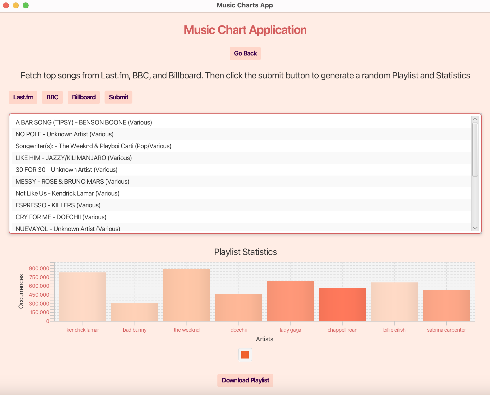

# 🎵 Music Chart Desktop Application

A JavaFX-based music chart desktop application that scrapes, visualizes, and curates top trending songs from **Billboard, Last.fm, and BBC Charts**. The app generates a suggested playlist based on overlapping top-ranked songs and provides data visualizations for artist popularity.

## **📽️ Demo **


---

## **📌 Features**

✅ **Scrapes top music charts** from **Billboard, Last.fm, and BBC** using **Jsoup**.  
✅ **Generates a "Suggested Playlist"** by analyzing common songs across multiple charts.  
✅ **Interactive UI** with a **JavaFX ListView** to display curated playlists.  
✅ **Bar chart visualization** of popular artists based on song count and listener statistics.  
✅ **Downloadable playlists** as **.txt files** for easy sharing.  
✅ **Responsive UI with JavaFX** for a seamless user experience.

---

## **🛠️ Technologies Used**

- **JavaFX** – UI components for interactive elements.
- **Jsoup** – Web scraping to extract chart data.
- **Java Collections (LinkedList, HashMap, HashSet)** – Data handling and playlist processing.
- **JavaFX BarChart API** – Data visualization for artist popularity.
- **JavaFX FileChooser API** – File export functionality.

---

## **🚀 Installation & Usage**

### **Prerequisites**
- Java 17+
- JavaFX SDK
- Maven (if building via Maven)

### **Running the Application**
1. Clone the repository:
   ```sh
   git clone https://github.com/yourusername/music-charts-app.git
   cd music-charts-app
   ```  
2. Compile and run:
   ```sh
   mvn clean javafx:run
   ```  
   OR manually via Java:
   ```sh
   javac -d out --module-path "path_to_javafx/lib" --add-modules javafx.controls,javafx.fxml src/org/example/musiccharts/*.java
   java -cp out --module-path "path_to_javafx/lib" --add-modules javafx.controls,javafx.fxml org.example.musiccharts.MusicChartsApplication
   ```  

---

## **🎯 How It Works**

1. **Launch the app** and click **"Get Started"**.
2. **Select a music chart** (Billboard, Last.fm, or BBC).
3. The app **scrapes the chart data** and displays a **list of trending songs**.
4. Click **"Generate Suggested Playlist"** to combine and rank the most popular songs.
5. View **artist popularity trends** using **interactive bar charts**.
6. Click **"Download Playlist"** to save the curated list as a **.txt file**.

---

## **📚 Code Structure**

```
music-charts-app/
│── src/
│   ├── org/example/musiccharts/
│   │   ├── MusicChartsApplication.java  # Main entry point
│   │   ├── MusicChartsController.java   # Handles UI interactions and logic
│   │   ├── music-charts.fxml            # UI layout file
│── pom.xml (if using Maven)
│── README.md
```  

---

## **📮 Contributions**

Want to improve this project? Follow these steps:
1. **Fork the repo**
2. **Create a new branch**
3. **Make your changes**
4. **Submit a pull request**

---


